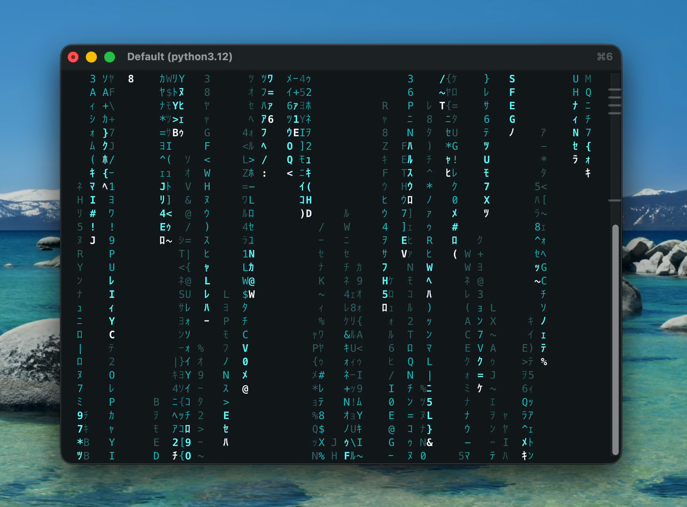

# Matrix Digital Rain

[](https://github.com/user-attachments/assets/0adf186a-7ae5-43f6-ba07-7b91a3a32b0e)

A terminal-based Matrix digital rain effect written in Python using curses. Features falling columns of half-width Katakana, digits, Latin characters, and symbols with a white flash leading each column — just like the film.


## Features

- Classic green-on-black Matrix rain with white flash heads
- Configurable speed, density, trail length, and FPS
- 5 built-in presets: `classic`, `dense`, `slow`, `rainbow`, `storm`
- 7 color options: green, red, blue, cyan, yellow, magenta, white
- Rainbow mode with shifting column colors
- Interactive menu or CLI flags
- Character mutation for authentic flickering effect
- Responsive to terminal resize

## Quick Start

```bash
python -m matrix_rain
```

This opens an interactive menu where you can pick a preset or customize settings.

You can also run it directly from anywhere without installing, using [uv](https://docs.astral.sh/uv/):

```bash
uv run --directory /path/to/matrix-rain matrix-rain
```

## CLI Usage

```bash
# Run with a preset
python -m matrix_rain --preset classic

# Custom settings
python -m matrix_rain --speed 1.5 --density 1.2 --color cyan

# Rainbow mode
python -m matrix_rain --rainbow

# Full control
python -m matrix_rain --speed 2.0 --density 1.5 --fps 30 --trail-min 0.2 --trail-max 0.8 --color green
```

### Options

| Flag            | Description                              | Default |
|-----------------|------------------------------------------|---------|
| `--preset`      | Use a built-in preset                    | —       |
| `--speed`       | Fall speed (0.1 – 4.0)                   | 1.0     |
| `--density`     | Stream density (0.1 – 3.0)               | 0.7     |
| `--color`       | Text color                               | green   |
| `--rainbow`     | Enable rainbow mode                      | off     |
| `--fps`         | Frames per second (10 – 60)              | 24      |
| `--trail-min`   | Min trail length (fraction of height)    | 0.25    |
| `--trail-max`   | Max trail length (fraction of height)    | 1.0     |
| `--message`     | Text to reveal when `t` is pressed       | —       |
| `-i`            | Force interactive menu                   | —       |

### Presets

| Preset    | Speed | Density | FPS | Description                  |
|-----------|-------|---------|-----|------------------------------|
| `classic` | 1.0   | 0.7     | 24  | The default look             |
| `dense`   | 1.2   | 1.5     | 30  | More streams, slightly faster|
| `slow`    | 0.4   | 0.4     | 20  | Calm, sparse rain            |
| `rainbow` | 1.0   | 0.8     | 24  | Shifting rainbow colors      |
| `storm`   | 2.0   | 2.0     | 30  | Fast and heavy               |

Press **q** or **ESC** to quit while running. Press **t** to trigger text reveal (requires `--message`).

## Installing to PATH

Install the package so you can run `matrix-rain` from anywhere:

```bash
# Option 1: Install with pip (recommended)
pip install .

# Option 2: Install in editable mode (changes to the source take effect immediately)
pip install -e .
```

After installing, just run:

```bash
matrix-rain
```

### Using a virtual environment

If you prefer not to install globally:

```bash
python -m venv .venv
source .venv/bin/activate   # on macOS/Linux
pip install -e .
```

The `matrix-rain` command will be available whenever the virtual environment is active.

### Using pipx (isolated install)

```bash
pipx install .
```

This installs `matrix-rain` globally in its own isolated environment.

## Project Structure

```
matrix_rain/
├── __init__.py      # Public API and re-exports
├── __main__.py      # python -m matrix_rain support
├── cli.py           # Argument parsing and entry point
├── constants.py     # Character sets, colors, presets, block font
├── engine.py        # MatrixRain curses engine and text reveal
├── menu.py          # Interactive terminal menu
└── stream.py        # Stream class (single falling column)
```

## Requirements

- Python 3.12+
- A terminal with Unicode support (most modern terminals)
- No external dependencies
